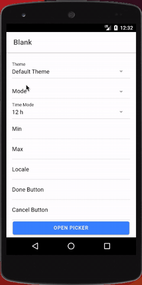
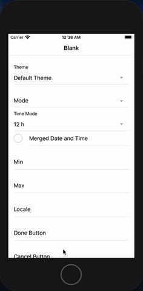

<p align="center"><br></p>
<h3 align="center">Capacitor Date Picker</h3>
<p align="center"><strong><code>@capacitor-community/date-picker</code></strong></p>
<p align="center">
  Capacitor community plugin for native Date Picker
</p>

<p align="center">
  
  <a href="https://www.npmjs.com/package/@capacitor-community/date-picker"></a>
<br>
  <a href="https://www.npmjs.com/package/@capacitor-community/date-picker"></a>
  <a href="https://www.npmjs.com/package/@capacitor-community/date-picker"></a>
  <!-- ALL-CONTRIBUTORS-BADGE:START - Do not remove or modify this section -->
<a href="#contributors"></a>
<!-- ALL-CONTRIBUTORS-BADGE:END -->
</p>

## Maintainers

| Maintainer     | GitHub                                                  | Social                                          |
| -------------- | ------------------------------------------------------- | ----------------------------------------------- |
| Stewan Silva   | [stewwan](https://github.com/stewwan)                   | [@StewanSilva](https://twitter.com/StewanSilva) |
| Daniel Pereira | [danielprrazevedo](https://github.com/danielprrazevedo) | [@DandanPrr](https://twitter.com/DandanPrr)     |

## Notice 🚀

We're starting fresh under an official org. If you were using the previous npm package `capacitor-datepick`, please update your package.json to `@capacitor-community/date-picker`. Check out [changelog](/CHANGELOG.md) for more info.

## Installation

Using npm:

```bash
npm install @capacitor-community/date-picker
```

Using yarn:

```bash
yarn add @capacitor-community/date-picker
```

Sync native files:

```bash
npx cap sync
```

## Roadmap

### ios

- [x] present
- [x] config
  - [x] format
  - [x] locale
  - [x] date
  - [x] mode
  - [x] theme
  - [x] timezone
  - [x] min
  - [x] max
  - [x] doneText
  - [x] cancelText
  - [x] is24h
  - [x] titleFontColor
  - [x] titleBgColor
  - [x] bgColor
  - [x] fontColor
  - [x] buttonBgColor
  - [x] buttonFontColor
  - [x] mergedDateAndTime

### android

- [x] present
- [x] config
  - [x] format
  - [x] locale
  - [x] date
  - [x] mode
  - [x] theme
  - [x] timezone
  - [x] min
  - [x] max
  - [x] doneText
  - [x] cancelText
  - [x] is24h

### web

- [ ] present
- [ ] config
  - [ ] format
  - [ ] locale
  - [ ] mode
  - [ ] theme
  - [ ] background
  - [ ] min
  - [ ] max
  - [ ] doneText
  - [ ] cancelText
  - [ ] timezone
  - [ ] title

## API

p- `present(DatePickerOptions): Promise<{ value:string }>`

### Config for iOS (`DatePickerOptions`)

These options can be used through the `present` method and/or within `capacitor.config.json`

| name            | type              | default                          |
| --------------- | ----------------- | -------------------------------- |
| format          | `string`          | `"yyyy-MM-dd'T'HH:mm:ss.SSS'Z'"` |
| locale          | `string`          | **_`current device`_**           |
| date            | `string`          | **_`current date`_**             |
| mode            | `DatePickerMode`  | `"dateAndTime"`                  |
| theme           | `DatePickerTheme` | `"light"`                        |
| timezone        | `string`          | **_`current device`_**           |
| min             | `string`          | `null`                           |
| max             | `string`          | `null`                           |
| doneText        | `string`          | `"OK"`                           |
| cancelText      | `string`          | `"Cancel"`                       |
| is24h           | `boolean`         | `false`                          |
| titleFontColor  | `string`          | `null`                           |
| titleBgColor    | `string`          | `null`                           |
| bgColor         | `string`          | `null`                           |
| fontColor       | `string`          | `null`                           |
| buttonBgColor   | `string`          | `null`                           |
| buttonFontColor | `string`          | `null`                           |

### Config for Android (`DatePickerOptions`)

These options can be used through the `present` method and/or within `capacitor.config.json`

| name       | type              | default                          |
| ---------- | ----------------- | -------------------------------- |
| format     | `string`          | `"yyyy-MM-dd'T'HH:mm:ss.SSS'Z'"` |
| locale     | `string`          | **_`current device`_**           |
| date       | `string`          | **_`current date`_**             |
| mode       | `DatePickerMode`  | `"dateAndTime"`                  |
| theme      | `DatePickerTheme` | `"light"`                        |
| timezone   | `string`          | **_`current device`_**           |
| min        | `string`          | `null`                           |
| max        | `string`          | `null`                           |
| doneText   | `string`          | `"OK"`                           |
| cancelText | `string`          | `"Cancel"`                       |
| is24h      | `boolean`         | `false`                          |

> For more information check the [`definitions`](/src/definitions.ts) file

## Demo




## Usage

```js
import { Plugins } from "@capacitor/core";
import { DatePickerPluginInterface } from "@capacitor-community/date-picker";

const DatePicker: DatePickerPluginInterface = Plugins.DatePickerPlugin as any;
const selectedTheme = "light";

DatePicker
  .present({
    mode: "date",
    locale: "pt_BR",
    format: "dd/MM/yyyy",
    date: "13/07/2019",
    theme: selectedTheme,
  })
  .then((date) => alert(date.value));
```

### Capacitor Config

```json
{
  //...
  "plugins": {
    "DatePickerPlugin": {
      "mode": "date",
      "locale": "pt_BR",
      "current": "13/07/2019",
      "format": "dd/MM/yyyy"
    }
  }
}
```

## iOS setup

- `ionic start my-cap-app --capacitor`
- `cd my-cap-app`
- `npm install --save @capacitor-community/date-picker`
- `mkdir www && touch www/index.html`
- `sudo gem install cocoapods` (only once)
- `npx cap add ios`
- `npx cap sync ios` (every time you run `npm install`)
- `npx cap open ios`

> Tip: every time you change a native code you may need to clean up the cache (Product > Clean build folder) and then run the app again.

## Android setup

- `ionic start my-cap-app --capacitor`
- `cd my-cap-app`
- `npm install --save @capacitor-community/date-picker`
- `mkdir www && touch www/index.html`
- `npx cap add android`
- `npx cap sync android` (every time you run `npm install`)
- `npx cap open android`
- `[extra step]` in android case we need to tell Capacitor to initialise the plugin:

> on your `MainActivity.java` file add `com.getcapacitor.community.datepicker.DatePickerPlugin;` and then inside the init callback `add(DatePickerPlugin.class);`

Now you should be set to go. Try to run your client using `ionic cap run android --livereload --address=0.0.0.0`.

> Tip: every time you change a native code you may need to clean up the cache (Build > Clean Project | Build > Rebuild Project) and then run the app again.

## Updating

For existing projects you can upgrade all capacitor related packages (including this plugin) with this single command

`npx npm-upgrade '*capacitor*' && npm install`

## Example

https://github.com/capacitor-community/date-picker/tree/master/example

## License

MIT

## Contributors ✨

Thanks goes to these wonderful people ([emoji key](https://allcontributors.org/docs/en/emoji-key)):

<!-- ALL-CONTRIBUTORS-LIST:START - Do not remove or modify this section -->
<!-- prettier-ignore-start -->
<!-- markdownlint-disable -->
<table>
  <tr>
    <td align="center"><a href="https://twitter.com/StewanSilva"><br /><sub><b>Stew</b></sub></a><br /><a href="https://github.com/capacitor-community/date-picker/commits?author=stewwan" title="Code">💻</a> <a href="https://github.com/capacitor-community/date-picker/commits?author=stewwan" title="Documentation">📖</a></td>
    <td align="center"><a href="https://github.com/danielprrazevedo"><br /><sub><b>Daniel Pereira</b></sub></a><br /><a href="https://github.com/capacitor-community/date-picker/commits?author=danielprrazevedo" title="Code">💻</a> <a href="https://github.com/capacitor-community/date-picker/commits?author=danielprrazevedo" title="Documentation">📖</a> <a href="#maintenance-danielprrazevedo" title="Maintenance">🚧</a></td>
  </tr>
</table>

<!-- markdownlint-enable -->
<!-- prettier-ignore-end -->

<!-- ALL-CONTRIBUTORS-LIST:END -->

This project follows the [all-contributors](https://github.com/all-contributors/all-contributors) specification. Contributions of any kind welcome!
